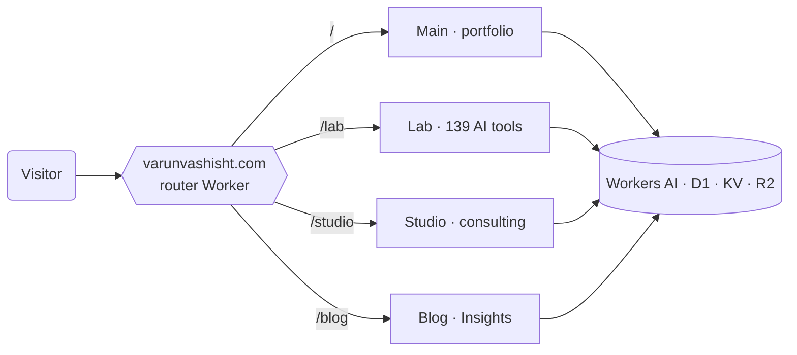

## Hi there, I'm Varun 👋

Senior Program Manager, Technical Program Manager, and Business Architect with **14+ years** delivering enterprise digital transformation and PMO governance across healthcare, oil & energy, fintech, ed-tech, and telecom. Programmes up to **$8M**, cross-functional teams of **20+**, PMP / CBAP / PMI-PBA / Six Sigma Black Belt certified, and a TCS Certified GenAI Practitioner putting generative AI to work in real delivery.

I also build in the open, on the Cloudflare edge.

> The card above is not a screenshot. It is an SVG rendered on every request by one of my own Cloudflare Workers, so the timestamp is always fresh.

---

### 🗺️ The network I run

One router Worker at the apex domain fans every request out to four independent, server-rendered edge backends.

### 🔭 What I'm building
- A small network of personal sites running on Cloudflare Workers, all server-rendered and hand-built.
- A growing set of AI utilities on Cloudflare Workers AI: text, vision, and image tools, no client-side keys.
- Getting properly hands-on with the modern data stack: an analytics warehouse on Snowflake, built end to end.

### 🧠 What I do
- Programme, technical-programme, and engineering-programme management
- PMO setup, governance, and portfolio delivery
- Business architecture and analysis (BRD / FRD / SRS, BPMN, gap and impact analysis)
- Generative AI in delivery: prompt engineering, AI-assisted requirements and reporting, AI/ML proofs of concept

### ⚡ One I'm proud of
Built an AI/ML resource-allocation proof of concept in Python that cut project-to-resource matching time by **80%**.

### ✍️ Latest from the journal
<!-- BLOG-POST-LIST:START -->- [The most expensive way to sound like everyone else.](https://varunvashisht.com/blog/the-most-expensive-way-to-sound-like-everyone-else/) - [Which model, when. And do we really need Fable?](https://varunvashisht.com/blog/which-model-when/) - [The Mindset Tech PMs Need Right Now &lpar;Hint: It&#39;s Not What You Think&rpar;](https://varunvashisht.com/blog/the-mindset-tech-pms-need-right-now-hint-it-s-not-what-you-think/) - [The four AI tools that actually stuck. A six-month receipt.](https://varunvashisht.com/blog/four-tools-that-actually-stuck/) <!-- BLOG-POST-LIST:END -->

[Read more on the journal →](https://varunvashisht.com/blog/)

### 💬 Ask me about
- Programme management (PMP) and business analysis (CBAP)
- Digital transformation and enterprise platform delivery
- Putting AI to work inside delivery and the PMO

<b>🧰 Tools &amp; certifications</b>

 

**Tools I reach for**  
Python · SQL · SSIS ETL · Power BI · Tableau · Snowflake  
Azure (DP-900, SC-900) · Azure DevOps · REST APIs  
Microsoft Dynamics 365 · Zoho One · Jira · Confluence  
Agile (Scrum, Kanban, SAFe) · PMBOK · BABOK · Lean Six Sigma · ITIL 4

**Certifications**  
PMP · CBAP · PMI-PBA · Lean Six Sigma Black Belt · ITIL Foundation  
Microsoft DP-900 · Microsoft SC-900 · TCS Certified GenAI Practitioner  
Google Data Analytics · HarvardX (Exercising Leadership, plus CS for AI in progress)

### 📫 Reach me
- 🌐 [varunvashisht.com](https://varunvashisht.com)
- [LinkedIn](https://www.linkedin.com/in/varunvashisht1)
- [Email](mailto:varun.vashisht@live.com)
